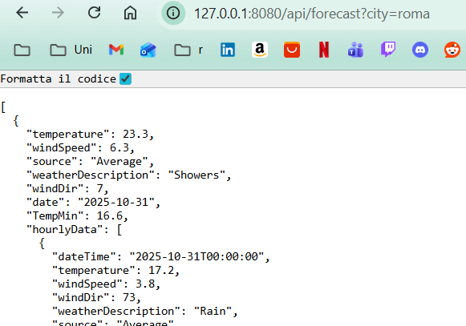
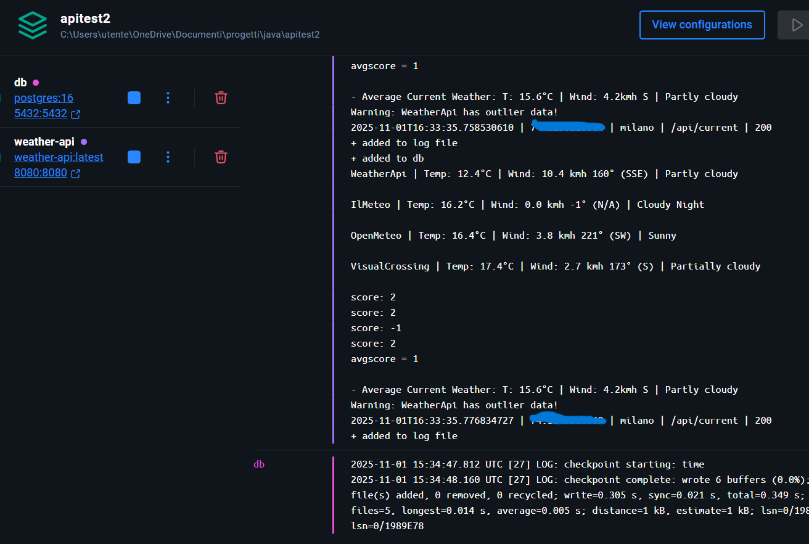
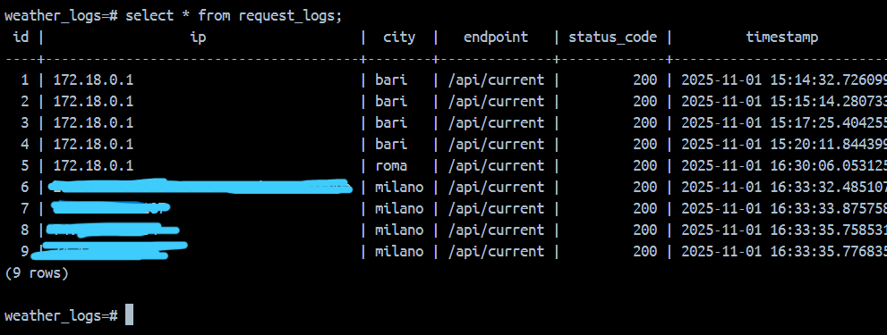

# ⛅ Multi Weather Api
Rest Api made using Spring boot framework that compares multiple Weather APIs/scrapers to deliver the best possible forecast for a given location, and shows daily/hourly data from each API.

In the image below is an example of a simple request for the weather forecast of Rome for the next few days.

# ⚙ How to run




### 1) Requirements
Docker, Docker Compose, Java 23+, Maven.

You will also need a ```.env``` file and an updated ```application.properties``` with working APIs.

### 2) Compiling the app 

```cd Multi-Weather-Api/code```





```./mvnw clean package -DskipTests```

```docker build -t weather-api:latest . ```

```docker compose build```

```docker compose up```


The API will be available at http://localhost:8080/api/, the  PostgreSQL instance  at localhost:5432; you can port forward with
```ngrok http 8080``` once you add the ngrok authtoken.


### 3) Checking logs and db 



You can connect to the DB manually with ```docker exec -it weather_db psql -U weath_api_logger -d weather_logs``` in the db container terminal, then with ```SELECT * FROM request_logs;``` you can view user info such as IPs, requests, api data, etc.

You can find more images about the api in the media folder.

# 💻 Code & APIs

This backend is a light rework of my previous repo [Multi Weather App](https://github.com/Hue-Jhan/Multi-Weather-App), it's handled by the WeatherController class. I included another api called HelloController just for fun.

The APIs i used in WeatherController are:

- GeoCodeMaps Api ([here](https://geocode.maps.co/));
- VisualCrossing Api ([here](https://www.visualcrossing.com/weather-query-builder/)), international;
- AccuWeather Api, ([here](https://developer.accuweather.com/)), international but requires location key from each city, which requires its Nation code, because of this i set this Api for italian cities only, but this api sucks for various reasons so don't use it;
- OpenMeteo Api ([here](https://open-meteo.com/en/docs)), international;
- WeatherApi.com Api ([here](https://www.weatherapi.com/)), international;
- IlMeteo (scraper, [here](http://ilmeteo.it/meteo/)), only works for Italy and some general european locations;
- Windy (work in progress Api, [here](https://api.windy.com/)), international.


The code makes requests to the APIs to extract the current weather data, and the forecast data for the next few days, including hourly data. The weather informations are then saved into custom data types, an average result is calculated and given as a json result.

Data such as user's ip, request, request params, are saved in  requests.log file and also in a Postgresql instance.

Make sure to have active and working API keys in the ```.env/app.properties``` files. Some keys are extracted from the ```.env```, others are taken directly from ```app.properties```, i tried using exclusively the .env file but i had some issues trying to set it up, i tried using several libraries but i gave up and just went with hardcoding them in ```app.properties```. 

### 📊 Average Data Algorithm

When calculating the average weather condition (like cloudy or sunny), getting the "best median result" out of all apis is quite a difficult job because some apis are less accurate than others or give entirely different results, so what i did was using custom maps, dictionaries, other data types and algorithms to convert weather info into score points (i assigned more points to IlMeteo cuz its the best italian weather system imo), then calculating an average result out of those points, here are some examples:

- Cloudy = 2, so if 4 apis say Cloudy and the fifth one says 3 (rainy), the median is [(2x4)+3]/5 =^ 2, which means the final result will be Cloudy;
- Sunny = -1, so if 3 apis say Sunny and 2 say Showers (4), the median is more or less 1, which means the final result will be Cloudy, however it's highly unlikely that apis give such different conditions for the same location. 

Why isn't Sunny 0? because statistically (i mean from what i've experienced) if the weather says it's going to be a Sunny day, there aren't going to be sudden changes in the forecast and the weather will be almost certainly sunny through the whole day, so i might as well say -1 or -5 cuz the result will most likely not change, while if the forecast says cloudy then there might be chanches of rain, which means the calculations have to be more precise to accurately predict weather it's going to rain or not. I did not include the "chanche of rain" variable in the data types, however EVERY api i used has this value, if you want you can modify the entire code, fetch this value and add it to the data types. 

The average wind direction is calculated using radians of course, then turned into degrees and the string corresponding to the name of the direction (eg SSW for south-south-west). The remaining data like temperature and windspeed is a simple median calculation.


